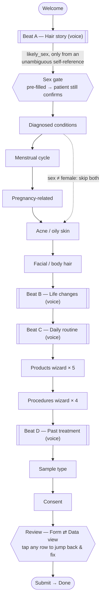
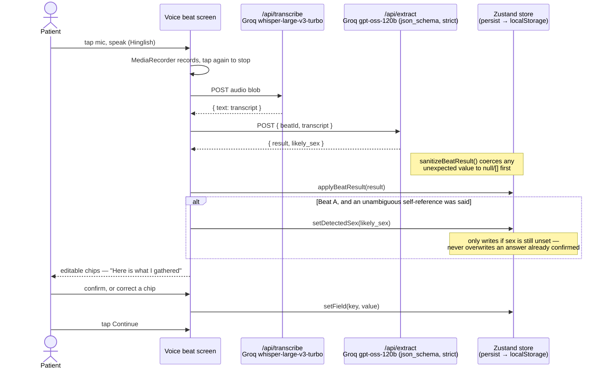

# GenoRoot Hair & Scalp Intake

A voice-and-tap copilot that gets a patient through a 16-question hair & scalp
intake before their consultation — talking for the questions that are easiest
to say, tapping for the ones that are easiest to point at, and never a
"chat with a bot" screen.

## Walking through it as a patient

*This is the two minutes I'd give you on a screening call — the required screen recording, in words, since it's easier to make precise as text.*

I open the link on my phone. No login, no clinic picker — just **"Let's get you ready for your consultation,"** a photo, and a speaker icon so I can hear what I'm in for before committing to anything. I tap **Start intake**.

**Beat A — Hair story.** The copilot asks, out loud in Hinglish, when my hair loss started, how long it's run, and whether it's in the family. I tap the mic and just talk over it in one breath, the way I would to a nurse: *"Mujhe karib 3 saal pehle, jab main 28 ka tha, hairline peeche jaana shuru hua tha. Papa ko bhi yehi problem thi."* A brief "Samajh rahe hain…" bubble, then four editable chips land in a chat bubble — age 28, duration "Over a year," family history "Father," pattern "Receding hairline." Each one opens inline or in a bottom sheet if I want to correct it, but they're right, so I tap Continue.

**The sex question — the brief's named "design consideration."** Questions 6 and 7 (menstrual cycle, pregnancy-related hair loss) only apply to a female patient, and the assignment is explicit that *how* I learn that — or whether I even ask — is itself part of what's being judged. I ask; "Prefer not to say" is always on the card, since forcing a choice is worse than the alternative. But I don't ask cold. Beat A already ran, and Hindi often won't let you describe your own state without giving your gender away — *"pareshaan **tha**"* is what a man says, *"pareshaan **thi**"* is what a woman says, same sentence otherwise. If my answer just now contained a cue like that, the female (or male) card is already selected when this screen loads, with a small banner: *"Based on what you told us just now, we've pre-selected one below — please confirm it's right, or pick another."* I still have to tap something to move on — nothing was decided for me behind my back, and I can just as easily pick the other one. That gate is deliberate: the model is told to set this only from an unambiguous grammatical or explicit self-reference, never from topic, tone, or name, and to default to "didn't catch it" whenever unsure — because in a clinical intake, confidently telling a patient the wrong thing about themselves is a worse failure than not guessing at all.

**The tap screens.** Conditions, then (because I confirmed female) menstrual cycle and pregnancy history, then acne, then facial hair — five screens of big illustrated tap targets, maybe fifteen seconds total. "None" is its own chip, not a fifth option buried in a list, and tapping it visibly clears anything else selected — "none of these" and "I picked four of five" shouldn't look the same at a glance.

**Beats B & C — life changes and daily routine.** More talking: "*pichhle saal COVID hua tha aur bahut stress bhi*" comes back as "Fever/illness" + "High stress." For routine I mention smoking half a pack a day and a keratin treatment last month; the "how many a day" and "which treatment" follow-ups appear nested under their parent chip only because I said Yes — not two more screens I'd click through regardless. If I'd said "*kuch nahi*" for beat B instead, that's a complete, confident empty answer, not a red "you missed something."

**Products & procedures.** Instead of one long grid — 5 products × 4 columns, the classic spreadsheet-in-disguise mobile form — it's one decision at a time per row: used it? for how long? did it help? side effects? then the next product. Same for the four in-clinic procedures.

**Beat D, sample type, consent.** One more voice beat for anything that went wrong with past treatment, a tap for saliva vs. blood, a checkbox for consent. The submit button never just silently does nothing if I forget something — it tells me what, then lets me decide.

**Review.** All 16 answers, grouped the way the clinic groups them, every row tappable to jump straight back and fix it — plus a **Data view** toggle showing the literal JSON about to reach my doctor. That's the same thing a grader would want to see, so I let the patient (and you) see it too, in the product itself, instead of a hidden debug view.

I tap **Submit intake**. Done in under two minutes, most of it spent talking instead of tapping.

### The decisions I'm proudest of

1. **Detect, suggest, never decide, on the sex question.** It's the one place the brief calls out by name as a design decision, and the tempting version — auto-select and move on — is also the version that quietly erodes trust the one time it's wrong. Gating the pre-fill behind an explicit confirm, and the extraction prompt behind "only an unambiguous cue, default to null," turned a plausible shortcut into something I'd actually ship.
2. **Built for a 55-year-old on a phone, not a 25-year-old on a laptop.** The brief's #1 judging criterion, taken literally rather than as a slogan: an 18px root font instead of the usual 16px, 44px-minimum tap targets, AAA-contrast light *and* dark themes (not a palette that only holds up in one), every prompt spoken aloud with a visible replay button in case reading is harder than listening, and illustrated options so recognizing "receding hairline" doesn't require parsing the phrase. A tap that silently does nothing is the single most disorienting thing a form can do to someone already unsure of themselves, so no button is ever natively `disabled` — each one is always tappable and either proceeds or says exactly what's still missing. And when an answer reveals more of the form — a "Yes" opening a follow-up field, a voice answer landing as chips — the screen **auto-scrolls that new content into view** instead of leaving it to silently render below the fold; this needed two separate fixes (the fixed mobile viewport and the desktop split-pane scroll independently), each verified against real DOM measurements rather than a visual guess.
3. **The modality matches the question, not the other way round.** Open, hard-to-tap-out answers (hair story, life changes, routine, past treatment) are voice; closed, enumerable ones are tap — down to turning a 5-row product table into a one-decision-at-a-time wizard instead of a scrolling spreadsheet, and making "kuch nahi" / "None" as valid and complete an answer as any option, never a "missing" state. That's the brief's "Taste" criterion, applied per question instead of picked once for the whole form.
4. **The validator can't drift from what's graded.** `lib/validation.ts` builds its Zod schema by walking `take-home-assignment.json`'s own `type`/`options` fields at runtime rather than a hand-written copy I'd have to remember to keep in sync — so "does this match the graded form" is a structural guarantee, checked live on the review screen, not a claim sitting in this README.

## How to run it

```bash
npm install
cp .env.example .env      # then fill in the two keys below
npm run dev
```

Open `http://localhost:3000`. Works on a phone on the same network too —
mic recording needs either `localhost` or HTTPS, which `next dev` gives you
locally; the deployed link is HTTPS by default.

Required env vars (`.env`, never committed):

| Key | Used for |
|---|---|
| `GROQ_API_KEY` | speech-to-text, structured extraction, and the pre-rendered voice prompts |
| `UPLOADCARE_PUBLIC_API_KEY` / `UPLOADCARE_SECRET_API_KEY` | reserved — see "Bought vs built" below |

The four voice-prompt audio clips are **pre-rendered**, not fetched live —
see `scripts/generate-tts.mjs` if you ever change the prompt scripts and need
to regenerate `public/audio/*.wav`.

## The shape of the flow

One continuous vertical flow, not two apps stitched together. The patient
never picks a mode — the screen underneath them just reshapes per question:

- **4 voice beats** (Sections A hair story, C10 life changes, C11 routine,
  D14 past treatment) — speak, get back editable chips, confirm, continue.
- **9 tap screens** for the rest (Q5–9, 12–13, 15–16) — big touch targets,
  illustrated where an illustration earns its place (conditions, sample
  type, pattern, past-6-months events), a fast per-row wizard for the two
  product/procedure tables instead of one long scrolling grid.
- **One review screen** at the end with a **Form view / Data view** toggle —
  the only legitimate second "mode" in the whole app, because it's two ways
  of looking at the *finished* result, not two ways of answering. Tap any
  row to jump back and fix it, then continue lands you back on review.
- Progress bar, back button and the primary CTA sit in the same place on
  every single screen.



*(Double-bordered nodes are the 4 voice beats; the hexagons are the two screens where the app is making a decision — pre-filling a guess or summarizing everything — rather than just recording a tap. `lib/steps.ts` is the source of truth this diagram mirrors; `menstrual`/`pregnancy` are the only two steps ever skipped, and always as a pair.)*

Answers persist to `localStorage` (Zustand + `persist`) so a patient who gets
interrupted mid-form — a call, a dropped signal, closing the tab by
accident — picks up exactly where they left off.

### The voice pipeline

What actually happens during one of the 4 voice beats — same round trip
every time, whether it's a 3-field beat or the sex-detection pre-fill on
Beat A:



## Your choices

**Models & services**

- **Groq `whisper-large-v3-turbo`** for transcription. Fast enough that the
  "Samajh rahe hain…" spinner is genuinely brief, and handles Hinglish
  code-switching (Hindi + English in the same sentence) well out of the box.
- **Groq `openai/gpt-oss-120b`** for extraction, called with
  `response_format: json_schema` (strict) and `reasoning_effort: "low"`. The
  strict schema means the model literally cannot return a value outside the
  form's own enums — no "PCOS" vs "PCOS/PCOD" drift to clean up later — and
  low reasoning effort keeps latency down since this is constrained
  extraction, not open-ended reasoning. See `lib/beats.ts` for the four
  per-beat schemas and `lib/groq.ts` for the call.
- **Groq `canopylabs/orpheus-v1-english`** (voice "autumn") for the
  copilot's spoken prompts — **pre-rendered once** at build time
  (`scripts/generate-tts.mjs`) into `public/audio/*.wav` rather than called
  per patient. That turns a ~5–7s TTS round trip into an instant local file
  play, at zero per-visit cost and zero runtime dependency on the TTS API.
  Falls back to the browser's built-in `SpeechSynthesis` if a clip ever
  fails to load.
- **Zustand + `persist`** for state, not React context or prop drilling —
  the intake is one long-lived state machine (16 questions, conditional
  steps, jump-back-to-edit) and `persist(localStorage)` gets "resume where
  I left off" for free.
- **Zod, schema-derived from `take-home-assignment.json` itself**
  (`lib/validation.ts`) rather than a hand-written parallel schema. The
  validator is *built by walking the JSON file's own `type`/`options`
  fields*, so it can't quietly drift from the graded schema — see "How you
  tested the fill" below.

**Bought vs built**

- Bought: Groq for STT/LLM/TTS (all three off one key, one bill, one very
  fast provider — didn't stand up a separate transcription service or pay
  for a dedicated TTS vendor).
- Built: the chip/sheet interaction system, the per-row product/procedure
  wizard, the review screen, and the JSON-schema-derived validator — these
  are the actual product, so they're first-party.
- **Uploadcare key provided but not wired in**: the brief's illustrations
  already ship as local files in `public/images/` (one per condition,
  pattern, sample type, etc. — see `lib/schema.ts`'s image maps), served
  and optimized by `next/image` with zero network dependency. Routing them
  through Uploadcare first would add a network hop and a second point of
  failure for no visible benefit at this scale, so I left the key
  configured but unused rather than force an integration that doesn't earn
  its place. With more images or user-uploaded photos, Uploadcare's
  transform-on-the-fly CDN would be the right call.

## How you tested the fill

1. **Schema-derived validation, not a parallel copy.** `lib/validation.ts`
   walks `take-home-assignment.json` at runtime and builds a Zod schema
   directly from each question's declared `type`/`options` — so "does the
   answer match the graded form" is a checked fact on the review screen
   (look for the "Validated against the clinic's schema" badge), not
   something I eyeballed once and hoped stayed true.
2. **Defense in depth on extraction.** Even though Groq's structured output
   is schema-constrained, `/api/extract` runs the response through
   `sanitizeBeatResult()` field-by-field before it ever reaches client
   state — any unexpected value is coerced to `null`/`[]` rather than
   corrupting the form.
3. **Manual voice-beat testing** with scripted Hinglish sentences per beat
   (age/duration/family history in one breath, "kuch nahi" for the
   life-changes beat, a smoking+salon combo for the routine beat) checked
   against the chips that came back, including the deliberately-not-said
   fields staying dashed instead of being guessed.
4. **`Data view` on the review screen** doubles as a manual test surface —
   the exact JSON that would be submitted is one tap away at any point, so
   a mismatch is visible immediately instead of hidden behind a form UI.
5. `next build` + `tsc --noEmit` + `eslint` clean as a baseline, plus
   headless Chrome (Playwright) for the layout bugs a type-checker can't
   see — real DOM measurements (element bounds, scroll position, computed
   styles) to root-cause and verify fixes instead of guessing from CSS
   alone. This sandbox has no system Chromium and no root by default, so
   that meant extracting the missing shared libraries from `.deb` packages
   by hand first. What that still isn't: a real phone in someone's actual
   hand — see below.

## What I'd improve with one more week

- **Real device QA.** I verified the API layer end-to-end (real Groq calls
  through the actual Next.js routes), root-caused and fixed several layout
  bugs against real headless-Chrome DOM measurements, and read every
  component path closely — but none of that is a phone in someone's actual
  hand. Mic permission prompts, a call interrupting mid-recording, a
  55-year-old's actual thumb on a 44px target — that's the first thing I'd
  do with real hardware.
- **Widen the sex-question detection a little, carefully.** It only fires
  on Beat A today, and only on a clear grammatical or explicit
  self-reference — so a patient whose first answer happens not to contain
  one (very possible) just sees the ordinary, un-pre-filled card, same as
  today. With a week I'd look for a couple more low-risk self-referential
  patterns within that same beat (still Beat A only, still "default to
  null" if unsure) rather than widen *where* it looks — the confirm gate
  makes false positives cheap, but I'd rather earn a higher hit rate than
  loosen the bar for what counts as a cue.
- **Deep-link review edits to the exact row**, not just the step — jumping
  back to fix one product in a 5-row table currently restarts that table's
  wizard from row 1.
- **Barge-in on the voice prompts** — let the patient start talking over
  the prompt audio instead of waiting for it to finish.
- **A nurse-facing "flagged for follow-up" pass** — e.g. auto-flag sudden
  shedding + recent fever, or PCOS + irregular cycle, as a one-line note
  for the doctor, since the brief explicitly asks for a *complete, accurate
  picture*, not just complete data.
- **Real submission target.** Right now "Submit" finalizes local state and
  moves to the done screen; a real deploy needs an endpoint (or EMR
  webhook) to actually deliver the JSON to the clinic.
